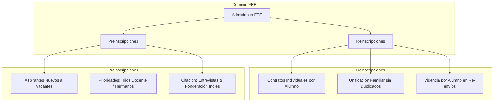
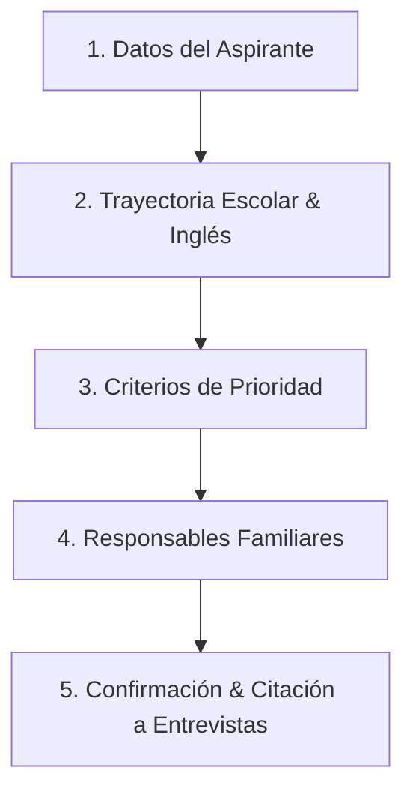
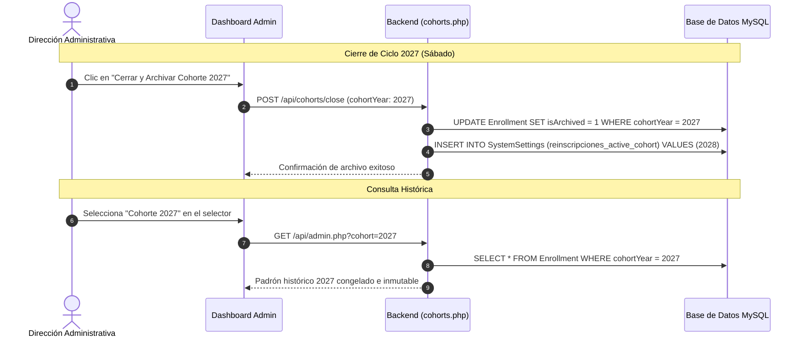

# ESPECIFICACIÓN TÉCNICA & ARQUITECTURA DE SOFTWARE INTEGRAL
## Motor Multianual de Admisiones & Gestión de Convocatorias (Reinscripciones / Preinscripciones)

**Institución:** Fundación Educativa Esquel (Escuela N.º 1030 & Escuela N.º 1739)  
**Proyecto:** FEE Web — Portal Institucional y Administrativo  
**Stack Tecnológico:** Next.js 16 (Static Export) + React 19 + TypeScript + PHP 8.x PDO + MySQL + Tailwind CSS  
**Entorno de Despliegue:** Hostinger Git Deployment  
**Fecha:** Agosto 2026  
**Versión:** 2.0.0-PROPOSAL  

---

## 1. RESUMEN EJECUTIVO & OBJETIVOS ESTRATÉGICOS

El sistema evoluciona desde un modelo de formularios estáticos hacia un **Motor de Admisiones Paramétrico y Multianual**, diseñado para resolver cuatro necesidades estructurales:

1. **Gestión de Estados y Conmutación Dinámica (Feature Flags / Toggles):**
   * Control administrativo en tiempo real sobre la apertura, cierre y transición entre las convocatorias públicas de **Reinscripciones** (alumnos regulares) y **Preinscripciones** (nuevos aspirantes), impidiendo la superposición no deseada en la UI pública.
2. **Ciclo de Vida Multianual y Versionado por Cohortes (2027, 2028, etc.):**
   * Persistencia histórica desacoplada con capacidad de "Cierre y Archivo de Cohorte", permitiendo consultar en cualquier momento los padrones, contratos e históricos de años anteriores sin mezclar registros con el ciclo lectivo en curso.
3. **Consolidación del Formulario Unificado de Preinscripción (Ingresantes 2027):**
   * Fusión de los requerimientos de Nivel Inicial, Primario (ficha Escuela N.º 1030) y Secundario (Escuela N.º 1739), incorporando campos críticos: condición de prioridad (hijo de personal docente/no docente, hermano de alumno actual), procedencia escolar, libre deuda de instituciones privadas, requerimientos de inglés (ponderación y acreditación para 3.º a 6.º grado) y convocatoria a entrevistas presenciales (7 y 8 de septiembre).
4. **Gobierno de Textos, Avisos y Fechas desde el Backend (Headless CMS Ligero):**
   * Panel de control que permite a la dirección escolar modificar textos de bienvenida, fechas de exámenes, cronogramas de entrevistas y mensajes de cierre sin requerir intervención en el código fuente ni nuevos despliegues en Git.

---

## 2. ANÁLISIS DE DOMINIO Y LECCIONES APRENDIDAS (AUDITORÍA 2027)

De las iteraciones previas del sistema de reinscripciones se extrajeron principios rectores inviolables:



* **Principio 1 (Individualidad Contractual):** El contrato educativo es **individual por estudiante** (Artículo 4 vinculante con curso y escuela específica), aunque la patria potestad y facturación sean compartidas en el grupo familiar.
* **Principio 2 (Padrón Limpio y Normalizado):** La base limpia unifica estudiantes por DNI (269 alumnos reales en 206 familias), evitando generar filas ficticias a partir de campos de texto libre de hermanos.
* **Principio 3 (Inmutabilidad de Cohortes Anteriores):** Cuando se cierra un ciclo, el padrón debe quedar congelado (snapshot) y etiquetado con su `cohortYear`.
* **Principio 4 (Segregación de Vistas):** La administración requiere separar nítidamente la operativa diaria de las herramientas de auditoría y depuración.

---

## 3. ARQUITECTURA DE DATOS & ESQUEMA RELACIONAL (MYSQL)

Para soportar cohortes históricas, estados configurables y preinscripciones completas, se extiende el esquema relacional en MySQL mediante migraciones DDL idempotentes en `api/config.php`:

### 3.1. Tabla `SystemSettings` (Configuración Dinámica y Estados de Convocatorias)

```sql
CREATE TABLE IF NOT EXISTS `SystemSettings` (
    `key` VARCHAR(100) PRIMARY KEY,
    `value` LONGTEXT NOT NULL,
    `type` ENUM('string', 'boolean', 'json', 'number') DEFAULT 'string',
    `description` VARCHAR(255) NULL,
    `updatedAt` DATETIME(3) DEFAULT CURRENT_TIMESTAMP(3) ON UPDATE CURRENT_TIMESTAMP(3)
) ENGINE=InnoDB DEFAULT CHARSET=utf8mb4 COLLATE=utf8mb4_unicode_ci;
```

**Claves Globales Sembradas por Defecto:**
* `reinscripciones_enabled` (`boolean`): `true`/`false` (Controla la apertura de `/reinscripciones`).
* `reinscripciones_active_cohort` (`number`): `2027` (Ciclo lectivo activo para reinscripciones).
* `reinscripciones_closed_message` (`json`): Objeto con título, cuerpo y vías de contacto para periodo cerrado.
* `preinscripciones_enabled` (`boolean`): `true`/`false` (Controla la apertura de `/preinscripciones`).
* `preinscripciones_active_cohort` (`number`): `2027` (Ciclo lectivo activo para ingresantes).
* `preinscripciones_interview_notice` (`string`): Texto institucional de citación para el 7 y 8 de septiembre.
* `preinscripciones_closed_message` (`json`): Mensaje informativo para cuando la preinscripción esté cerrada.

---

### 3.2. Tabla `Enrollment` (Extensión del Modelo de Admisiones)

```sql
ALTER TABLE `Enrollment`
    -- Gestión de Cohortes y Tipología
    ADD COLUMN IF NOT EXISTS `cohortYear` INT NOT NULL DEFAULT 2027 AFTER `type`,
    ADD COLUMN IF NOT EXISTS `isArchived` TINYINT(1) DEFAULT 0 AFTER `cohortYear`,

    -- Datos Específicos de Preinscripciones (Ingresantes)
    ADD COLUMN IF NOT EXISTS `studentBirthDate` DATE NULL AFTER `studentDni`,
    ADD COLUMN IF NOT EXISTS `currentSchool` VARCHAR(191) NULL AFTER `studentGrade`,
    ADD COLUMN IF NOT EXISTS `currentSchoolType` ENUM('publica', 'privada', 'otra') DEFAULT 'publica' AFTER `currentSchool`,
    ADD COLUMN IF NOT EXISTS `hasDebtClearance` TINYINT(1) DEFAULT 0 AFTER `currentSchoolType`,
    
    -- Criterios de Prioridad Institucional
    ADD COLUMN IF NOT EXISTS `isStaffChild` TINYINT(1) DEFAULT 0 AFTER `hasSiblings`,
    ADD COLUMN IF NOT EXISTS `staffMemberName` VARCHAR(191) NULL AFTER `isStaffChild`,
    ADD COLUMN IF NOT EXISTS `hasSiblingInSchool` TINYINT(1) DEFAULT 0 AFTER `staffMemberName`,
    ADD COLUMN IF NOT EXISTS `siblingCurrentGrade` VARCHAR(191) NULL AFTER `hasSiblingInSchool`,
    
    -- Requisitos de Idioma Inglés (Escuela N.º 1030)
    ADD COLUMN IF NOT EXISTS `englishAccreditationType` ENUM('ninguno', 'instituto', 'escuela_bilingue', 'particular') DEFAULT 'ninguno',
    ADD COLUMN IF NOT EXISTS `englishInstituteName` VARCHAR(191) NULL,
    ADD COLUMN IF NOT EXISTS `englishLevelAchieved` VARCHAR(100) NULL,
    
    -- Datos de Ocupación de Padres (Planilla Primaria)
    ADD COLUMN IF NOT EXISTS `parent1Occupation` VARCHAR(191) NULL AFTER `parent1Relationship`,
    ADD COLUMN IF NOT EXISTS `parent2Occupation` VARCHAR(191) NULL AFTER `parent2Relationship`,

    -- Índices de Rendimiento
    ADD INDEX IF NOT EXISTS `idx_cohort_type` (`cohortYear`, `type`),
    ADD INDEX IF NOT EXISTS `idx_student_dni` (`studentDni`),
    ADD INDEX IF NOT EXISTS `idx_created_at` (`createdAt`);
```

---

## 4. ARQUITECTURA BACKEND (PHP PDO & REST ENDPOINTS)

El backend opera como una API RESTful sin estado (stateless), protegida mediante JWT en cookies `HttpOnly` y firmas digitales:

```
api/
├── config.php          # Conexión PDO, migraciones automáticas DDL y autenticación JWT
├── settings.php        # [NUEVO] Endpoint GET/POST para lectura y escritura de parámetros globales
├── cohorts.php         # [NUEVO] Endpoint de consulta de cohortes históricas y cierre de ciclo
├── enroll.php          # Endpoint público de procesamiento y validación estricta de formularios
├── admin.php           # Endpoint protegido de administración (listados, métricas, actualización)
├── status.php          # Healthcheck y diagnóstico de base de datos
└── upload.php          # Almacenamiento seguro de firmas digitalizadas y adjuntos
```

### 4.1. `api/settings.php`
* **`GET` (Público):** Retorna el estado booleano de apertura de cada convocatoria y los textos/avisos institucionales vigentes.
* **`POST` (Protegido - Requiere `SUPER_ADMIN` o `EDITOR`):** Permite actualizar los switches de apertura/cierre y los textos informativos.

### 4.2. `api/cohorts.php`
* **`GET` (Protegido):** Retorna la lista de cohortes registradas (`[2027, 2026, ...]`) con volumen de trámites asociados.
* **`POST /close` (Protegido - `SUPER_ADMIN`):** Congela la cohorte actual (`isArchived = 1`) y promueve el año lectivo entrante (`cohortYear + 1`).

### 4.3. Validación en `api/enroll.php`
* **En Preinscripciones:** Valida campos escolares, fecha de nacimiento, procedencia, prioridades y datos de contacto. No exige CUIT de facturación ni firmas digitales.
* **En Reinscripciones:** Mantiene validación estricta de CUIT (Módulo 11), DNI, domicilio no numérico, firmas en base64 y aceptación contractual.

---

## 5. EXPERIENCIA DE USUARIO PÚBLICA (FRONTEND NEXT.JS)

### 5.1. Conmutación en Navbar
El botón de acción principal en `src/components/Navbar.tsx` consulta en el cliente el estado de `/api/settings.php` y se adapta:
* Si `reinscripciones_enabled === true` → Enlace a `/reinscripciones` con etiqueta *"Reinscripciones 2027"*.
* Si `preinscripciones_enabled === true` → Enlace a `/preinscripciones` con etiqueta *"Preinscripciones 2027"*.
* Si ambas están cerradas → Enlace a `/inscripciones` con etiqueta *"Admisiones & Inscripciones"* y banner informativo de fechas.

---

### 5.2. Formulario Unificado de Preinscripción (`/preinscripciones`)

Estructurado en 5 pasos lógicos:



1. **Datos del Aspirante:** Nombre y Apellido, DNI, Fecha de Nacimiento (con cálculo de edad al 30 de junio), Escuela (1030 Inicial/Primario vs 1739 Secundario), Sala / Grado / Año deseado, Domicilio.
2. **Trayectoria Escolar & Requisitos de Inglés:**
   * Escuela actual de procedencia y tipo de gestión (Estatal / Privada).
   * Compromiso de libre deuda para procedencias privadas.
   * Acreditación de nivel de inglés (instituto, examen internacional) para aspirantes de 3.º a 6.º Grado.
   * Notificación explícita de la toma de examen de ponderación de inglés.
3. **Criterios de Prioridad:**
   * ¿Es hijo/a de personal docente o no docente de la Fundación? (Nombre del agente).
   * ¿Tiene hermanos cursando actualmente en la Fundación? (Nombre y grado del hermano).
4. **Datos de los Progenitores / Tutores:**
   * Padre: Nombre, DNI, Ocupación, Celular, Email.
   * Madre: Nombre, DNI, Ocupación, Celular, Email (con opción de "Único Responsable").
5. **Pantalla de Éxito & Citación Obligatoria:**
   * Exhibición destacada de la citación para los días **7 y 8 de septiembre** en Escuela N.º 1030 (horarios de 9 a 12 hs y 14:30 a 16 hs) para entrevistas diagnósticas, examen de inglés y charla institucional.
   * Descarga de comprobante de preinscripción en PDF.

---

## 6. REDISEÑO DEL PANEL ADMINISTRATIVO (`/admin/`)

Se crea una pestaña maestra unificada: **"Inscripciones & Admisiones"** con 3 sub-pestañas:

```
[ PANEL ADMINISTRATIVO FEE ]
├── Novedades (Blog)
├── Galería
├── 📁 INSCRIPCIONES & ADMISIONES  ◄── (Módulo Central Unificado)
│   ├── Sub-Pestaña A: Reinscripciones 2027 (Alumnos Regulares)
│   │   ├── Selector de Cohorte Histórica [ 2027 ▼ ]
│   │   ├── Grupos Familiares (Consolidación Inteligente)
│   │   ├── Base Limpia (269 alumnos únicos + Contratos PDF Individuales)
│   │   └── Botón "Cerrar Cohorte 2027" (Acción de fin de ciclo)
│   │
│   ├── Sub-Pestaña B: Preinscripciones 2027 (Nuevos Aspirantes)
│   │   ├── Padrón de Aspirantes con filtro por Escuela / Nivel / Grado
│   │   ├── Insignias de Prioridad (Hijo Docente / Hermanos en FEE)
│   │   ├── Planilla de Citaciones para Entrevistas y Exámenes de Inglés
│   │   └── Exportación de Planilla de Admisión a Excel / CSV
│   │
│   └── Sub-Pestaña C: Configuración de Convocatorias & Avisos
│       ├── Toggles de Apertura/Cierre (Switch Reinscripciones / Switch Preinscripciones)
│       ├── Editor de Texto para Citación de Entrevistas (7 y 8 de Septiembre)
│       └── Editor de Mensajes de Periodo Cerrado
│
├── Consultas Web
├── Usuarios & Permisos
└── Auditoría & Sesiones
```

---

## 7. MODELO DE COHORTES & HISTÓRICOS



---

## 8. PLAN DE IMPLEMENTACIÓN POR FASES

* **Fase 1 (Base de Datos & Endpoints):**
  * Migraciones DDL automáticas en `api/config.php`.
  * Creación de `api/settings.php` y `api/cohorts.php`.
  * Actualización de `api/enroll.php` y `api/admin.php`.
* **Fase 2 (Formulario de Preinscripción 2027):**
  * Implementación del nuevo formulario modular con 5 pasos, prioridades, validaciones y citación a entrevistas.
* **Fase 3 (Dashboard Admin Unificado):**
  * Reorganización en el módulo maestro "Inscripciones & Admisiones".
  * Integración de switches de estado, selector de cohortes y vistas segregadas.
* **Fase 4 (Compilación, Build y Despliegue en Hostinger):**
  * `npm run build` local, verificación estática y sincronización en Git.

---
